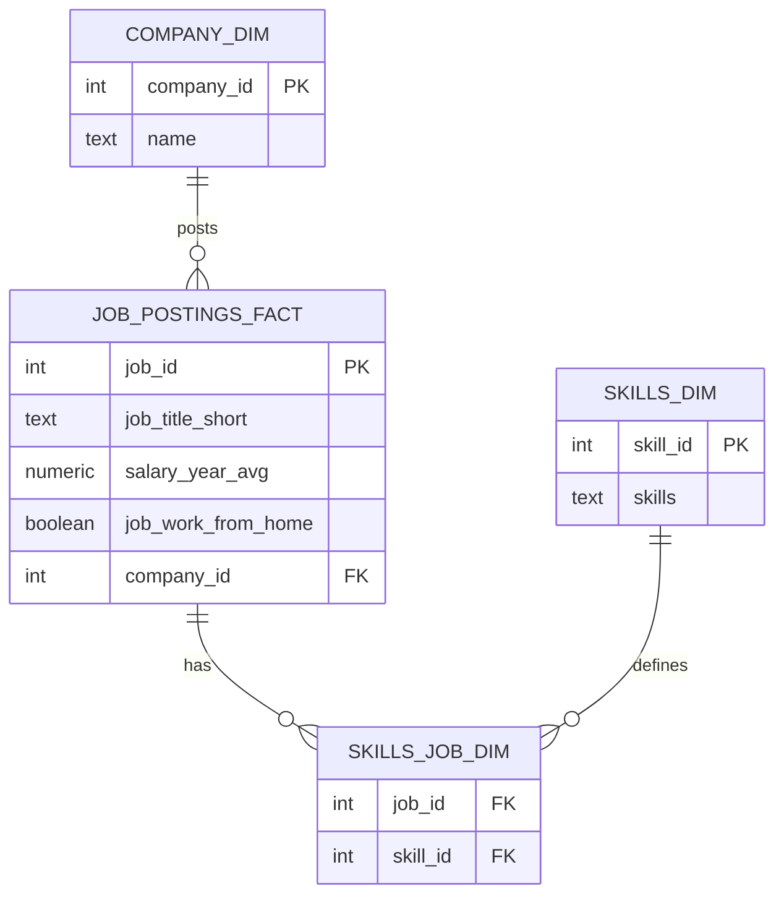

# Data Analyst Job Market Analysis (SQL)
## Overview
This portfolio project analyzes the **Data Analyst** job market using SQL to answer:

- **Top paying Data Analyst jobs**
- **Most demanded skills**
- **Highest paying skills**
- **Optimal skills** (high demand + strong salary)

All insights are generated from query outputs (CSV/JSON) and visualized below.

---

## Tech Stack
- SQL (PostgreSQL-style syntax)
- Fact + dimension data model
- Python (for charts)
- GitHub for documentation

---

## Database Schema (ER Diagram)



> Tip: If Mermaid doesn’t render on your GitHub view, export an ERD as `images/schema.png` and embed it.

---

# Analysis & Insights

## 1) Top Paying Data Analyst Jobs

**Chart**

)

**Insight**

- Highest salaries are dominated by **senior / leadership** analytics roles.
- Several postings exceed **$200k+**, showing strong pay for specialized analytics.
- Many top roles appear as **remote/hybrid**, depending on the dataset.

**SQL**

```sql
SELECT 
   job_id,
   cd.name as company_name,
   job_title,
   job_location,
   job_schedule_type,
   salary_year_avg,
   job_posted_date
FROM job_postings_fact as jp
LEFT JOIN company_dim as cd ON cd.company_id = jp.company_id
WHERE 
    job_title_short = 'Data Analyst' 
    AND job_work_from_home = TRUE
    AND salary_year_avg is NOT NULL
    ORDER BY salary_year_avg DESC
    LIMIT 10
```


---

## 2) Top Demanded Skills

**Chart**

)

**Insight**

- **SQL** is the #1 demanded skill by a wide margin.
- **Excel** remains very common in day-to-day analytics workflows.
- Visualization tools (**Tableau / Power BI**) show strong demand.

**SQL**

```sql
SELECT 
   sd.skills,
   sc.skill_count
FROM skills_dim as sd
JOIN(
SELECT sj.skill_id,
    count (sj.job_id) as skill_count 
FROM  skills_job_dim AS sj 
JOIN job_postings_fact as jp ON sj.job_id = jp.job_id
WHERE job_title_short = 'Data Analyst'
GROUP BY sj.skill_id
) as sc ON sd.skill_id = sc.skill_id
ORDER BY sc.skill_count DESC
LIMIT 10 ;


SELECT
    skills ,
    count(jp.job_id) as demand_count 
FROM job_postings_fact jp
JOIN skills_job_dim as sj ON jp.job_id = sj.job_id
JOIN skills_dim AS sd ON sd.skill_id = sj.skill_id
WHERE job_title_short = 'Data Analyst'
GROUP BY skills
ORDER BY demand_count DESC
LIMIT 10
```


---

## 3) Highest Paying Skills

**Chart**

)

**Insight**

- Some very high-paying skills are **specialized** (often closer to ML/infra/data engineering).
- These skills may be less frequent in pure analyst roles but command premium pay when required.

**SQL**

```sql
SELECT
    skills ,
   round (avg(salary_year_avg),0) as Avg_salary
FROM job_postings_fact jp
JOIN skills_job_dim as sj ON jp.job_id = sj.job_id
JOIN skills_dim AS sd ON sd.skill_id = sj.skill_id
WHERE job_title_short = 'Data Analyst' 
AND salary_year_avg is NOT NULL
GROUP BY skills
ORDER BY  Avg_salary DESC
LIMIT 10
```


---

## 4) Skills in Top Paying Jobs

**Insight**

- Top paying jobs often list a mix of **core analytics** (SQL/Python) and **data platforms** (cloud/tools).

**SQL**

```sql
WITH top_paying_jobs AS (
SELECT 
   job_id,
   cd.name as company_name,
   job_title,
   salary_year_avg
FROM job_postings_fact as jp
LEFT JOIN company_dim as cd ON cd.company_id = jp.company_id
WHERE 
    job_title_short = 'Data Analyst' 
    AND job_work_from_home = TRUE
    AND salary_year_avg is NOT NULL
    ORDER BY salary_year_avg DESC
    LIMIT 10)

SELECT
  tp.*,
  sd.skills
FROM top_paying_jobs as tp
JOIN skills_job_dim as sj ON tp.job_id = sj.job_id
JOIN skills_dim AS sd ON sd.skill_id = sj.skill_id
ORDER BY tp.salary_year_avg DESC
```


---

## 5) Optimal Skills (High Demand + High Salary)

**Chart**


**Insight**

- The best ROI skills sit in the **high-demand + high-salary** region.
- A strong learning path from this dataset: **SQL + Python + Visualization (Tableau/Power BI)**.
- Use this view to decide which skills to prioritize first.

**SQL**

```sql
WITH demanded_skills AS (
    SELECT
        sd.skill_id,
        sd.skills,
        COUNT(jp.job_id) AS demand_count
    FROM job_postings_fact jp
    JOIN skills_job_dim sj
        ON jp.job_id = sj.job_id
    JOIN skills_dim sd
        ON sd.skill_id = sj.skill_id
    WHERE jp.job_title_short = 'Data Analyst'
      AND jp.salary_year_avg IS NOT NULL
      AND jp.job_work_from_home = TRUE
    GROUP BY sd.skill_id, sd.skills
),
average_salary AS (
    SELECT
        sd.skill_id,
        ROUND(AVG(jp.salary_year_avg), 0) AS avg_salary
    FROM job_postings_fact jp
    JOIN skills_job_dim sj
        ON jp.job_id = sj.job_id
    JOIN skills_dim sd
        ON sd.skill_id = sj.skill_id
    WHERE jp.job_title_short = 'Data Analyst'
      AND jp.salary_year_avg IS NOT NULL
    GROUP BY sd.skill_id
)
SELECT
    ds.skill_id,
    ds.skills,
    ds.demand_count,
    a.avg_salary
FROM demanded_skills ds
JOIN average_salary a
    ON ds.skill_id = a.skill_id
ORDER BY ds.demand_count DESC, a.avg_salary DESC
LIMIT 25;
```


