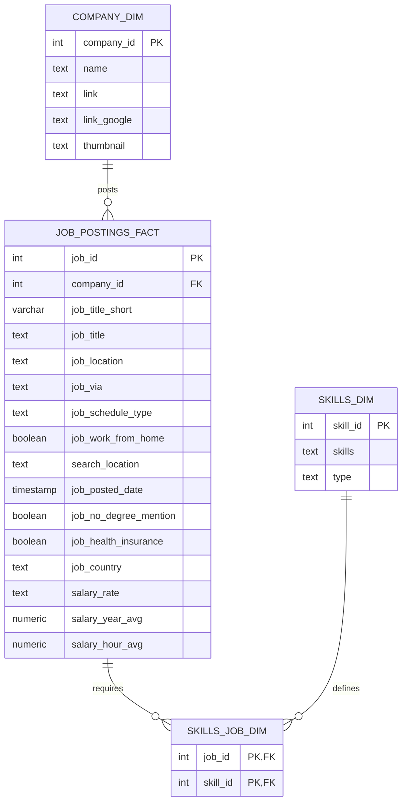

# Data Analyst Job Market Analysis (SQL)


## Introduction
This project analyzes the **Data Analyst job market** using SQL by exploring job postings, salary trends, and required skills. The goal is to identify the most valuable skills for data analysts by examining salary distributions, job demand, and the relationship between skills and compensation.

The analysis focuses on answering key questions:

- What are the highest-paying data analyst jobs?
- Which skills are most frequently requested?
- Which skills command the highest salaries?
- What skills provide the best combination of demand and salary?

---

# Background

The demand for data analysts continues to grow as organizations increasingly rely on data-driven decision making. However, the **salary levels and required skillsets vary widely depending on the tools and technologies used.**

Understanding these trends helps:

- Job seekers prioritize the most valuable skills
- Professionals identify high-paying technologies
- Companies understand the evolving analytics landscape

This project explores job postings to uncover **real-world insights about the data analyst job market.**

---

# Tools Used

| Tool | Purpose |
|-----|------|
| SQL | Data analysis |
| PostgreSQL | Querying job datasets |
| GitHub | Version control and documentation |
| JSON/CSV | Query result datasets |

### Key SQL Concepts Used

- JOINs
- Common Table Expressions (CTEs)
- Aggregations (`COUNT`, `AVG`)
- Subqueries
- CASE statements
- Filtering conditions

---

# Dataset Overview

The dataset contains job postings along with associated skills and salary information. The main tables used include:

- **job_postings_fact** – contains job posting details
- **skills_job_dim** – maps jobs to required skills
- **skills_dim** – contains skill names
- **company_dim** – contains company information

These tables were joined to analyze relationships between **skills, job demand, and salaries.**

---
## Analysis Overview
This portfolio project analyzes the **Data Analyst** job market using SQL to answer:

- **Top paying Data Analyst jobs**
- **Most demanded skills**
- **Highest paying skills**
- **Optimal skills** (high demand + strong salary)

All insights are generated from query outputs (CSV/JSON) and visualized below.

---

## Tech Stack
- SQL (PostgreSQL-style syntax)
- Fact + dimension data model
- Python (for charts)
- GitHub for documentation

---

## Database Schema (ER Diagram)


---

# Analysis & Insights

## 1) Top Paying Data Analyst Jobs

**Chart**


**Insight**

- Highest salaries are dominated by **senior / leadership** analytics roles.
- Several postings exceed **$200k+**, showing strong pay for specialized analytics.
- Many top roles appear as **remote/hybrid**, depending on the dataset.

**SQL**

```sql
SELECT 
   job_id,
   cd.name as company_name,
   job_title,
   job_location,
   job_schedule_type,
   salary_year_avg,
   job_posted_date
FROM job_postings_fact as jp
LEFT JOIN company_dim as cd ON cd.company_id = jp.company_id
WHERE 
    job_title_short = 'Data Analyst' 
    AND job_work_from_home = TRUE
    AND salary_year_avg is NOT NULL
    ORDER BY salary_year_avg DESC
    LIMIT 10
```


---

## 2) Top Demanded Skills

**Chart**


**Insight**

- **SQL** is the #1 demanded skill by a wide margin.
- **Excel** remains very common in day-to-day analytics workflows.
- Visualization tools (**Tableau / Power BI**) show strong demand.

**SQL**

```sql
SELECT 
   sd.skills,
   sc.skill_count
FROM skills_dim as sd
JOIN(
SELECT sj.skill_id,
    count (sj.job_id) as skill_count 
FROM  skills_job_dim AS sj 
JOIN job_postings_fact as jp ON sj.job_id = jp.job_id
WHERE job_title_short = 'Data Analyst'
GROUP BY sj.skill_id
) as sc ON sd.skill_id = sc.skill_id
ORDER BY sc.skill_count DESC
LIMIT 10 ;


SELECT
    skills ,
    count(jp.job_id) as demand_count 
FROM job_postings_fact jp
JOIN skills_job_dim as sj ON jp.job_id = sj.job_id
JOIN skills_dim AS sd ON sd.skill_id = sj.skill_id
WHERE job_title_short = 'Data Analyst'
GROUP BY skills
ORDER BY demand_count DESC
LIMIT 10
```


---

## 3) Highest Paying Skills

**Chart**


**Insight**

- Some very high-paying skills are **specialized** (often closer to ML/infra/data engineering).
- These skills may be less frequent in pure analyst roles but command premium pay when required.

**SQL**

```sql
SELECT
    skills ,
   round (avg(salary_year_avg),0) as Avg_salary
FROM job_postings_fact jp
JOIN skills_job_dim as sj ON jp.job_id = sj.job_id
JOIN skills_dim AS sd ON sd.skill_id = sj.skill_id
WHERE job_title_short = 'Data Analyst' 
AND salary_year_avg is NOT NULL
GROUP BY skills
ORDER BY  Avg_salary DESC
LIMIT 10
```


---

## 4) Skills in Top Paying Jobs

**Insight**

- Top paying jobs often list a mix of **core analytics** (SQL/Python) and **data platforms** (cloud/tools).

**SQL**

```sql
WITH top_paying_jobs AS (
SELECT 
   job_id,
   cd.name as company_name,
   job_title,
   salary_year_avg
FROM job_postings_fact as jp
LEFT JOIN company_dim as cd ON cd.company_id = jp.company_id
WHERE 
    job_title_short = 'Data Analyst' 
    AND job_work_from_home = TRUE
    AND salary_year_avg is NOT NULL
    ORDER BY salary_year_avg DESC
    LIMIT 10)

SELECT
  tp.*,
  sd.skills
FROM top_paying_jobs as tp
JOIN skills_job_dim as sj ON tp.job_id = sj.job_id
JOIN skills_dim AS sd ON sd.skill_id = sj.skill_id
ORDER BY tp.salary_year_avg DESC
```


---

## 5) Optimal Skills (High Demand + High Salary)

**Chart**


**Insight**

- The best ROI skills sit in the **high-demand + high-salary** region.
- A strong learning path from this dataset: **SQL + Python + Visualization (Tableau/Power BI)**.
- Use this view to decide which skills to prioritize first.

**SQL**

```sql
WITH demanded_skills AS (
    SELECT
        sd.skill_id,
        sd.skills,
        COUNT(jp.job_id) AS demand_count
    FROM job_postings_fact jp
    JOIN skills_job_dim sj
        ON jp.job_id = sj.job_id
    JOIN skills_dim sd
        ON sd.skill_id = sj.skill_id
    WHERE jp.job_title_short = 'Data Analyst'
      AND jp.salary_year_avg IS NOT NULL
      AND jp.job_work_from_home = TRUE
    GROUP BY sd.skill_id, sd.skills
),
average_salary AS (
    SELECT
        sd.skill_id,
        ROUND(AVG(jp.salary_year_avg), 0) AS avg_salary
    FROM job_postings_fact jp
    JOIN skills_job_dim sj
        ON jp.job_id = sj.job_id
    JOIN skills_dim sd
        ON sd.skill_id = sj.skill_id
    WHERE jp.job_title_short = 'Data Analyst'
      AND jp.salary_year_avg IS NOT NULL
    GROUP BY sd.skill_id
)
SELECT
    ds.skill_id,
    ds.skills,
    ds.demand_count,
    a.avg_salary
FROM demanded_skills ds
JOIN average_salary a
    ON ds.skill_id = a.skill_id
ORDER BY ds.demand_count DESC, a.avg_salary DESC
LIMIT 25;
```
---

# What I Learned

This project helped strengthen both my **SQL analysis skills** and my understanding of the **Data Analyst job market**.

### 1. Translating Business Questions into SQL Queries
I learned how to translate real-world analytical questions into SQL queries, such as:

- Identifying the **highest paying jobs**
- Finding the **most demanded skills**
- Discovering which skills provide the **best salary potential**

This required structuring queries using filters, joins, aggregations, and ordering to extract meaningful insights.

---

### 2. Working with Relational Data Models
The dataset follows a **fact and dimension schema**, which reflects how analytical databases are structured.

I practiced working with multiple related tables:

- `job_postings_fact`
- `skills_job_dim`
- `skills_dim`
- `company_dim`

Using joins between these tables helped analyze relationships between **jobs, skills, salaries, and companies.**

---

### 3. Using SQL for Data Analysis
This project strengthened my ability to perform analytical tasks using SQL, including:

- Using **JOINs** to combine multiple datasets
- Applying **aggregations** (`COUNT`, `AVG`) to identify trends
- Creating **Common Table Expressions (CTEs)** to simplify complex queries
- Filtering datasets to focus on specific job roles
- Ranking results to find **top jobs and high-value skills**

These are core techniques used in real-world **data analyst workflows.**

---

### 4. Understanding the Data Analyst Skill Landscape
By analyzing job postings and salary data, I gained insights into the most valuable skills in the market.

Some observations include:

- **SQL** remains the most essential and widely demanded skill.
- **Excel** continues to be heavily used for everyday analytics tasks.
- **Visualization tools** like Tableau and Power BI are important for reporting and dashboards.
- Advanced or specialized tools tend to appear less frequently but can offer **higher salaries.**

---

### 5. Communicating Data Insights
Beyond querying the data, this project helped me practice presenting insights clearly through:

- Visualizations
- Structured documentation
- GitHub project presentation

This is important because data analysts must **communicate insights effectively**, not just perform analysis.

---

# Conclusion

This project analyzes the **Data Analyst job market** by exploring job postings, salary trends, and required skills using SQL.

The analysis reveals several key insights:

- **SQL remains the most important foundational skill** for data analysts and appears in the majority of job postings.
- **Excel and visualization tools** such as Tableau and Power BI are widely used for business analysis and reporting.
- **Higher-paying roles often require a broader technical skillset**, including programming and advanced analytics tools.
- Skills like **Python and advanced data tools** are associated with higher salaries.

When considering both **job demand and salary potential**, the most valuable skill combination for aspiring data analysts appears to be:

- SQL  
- Python  
- Data Visualization (Tableau / Power BI)

These skills form the **core toolkit for modern analytics professionals.**

Overall, this project demonstrates how SQL can be used to extract meaningful insights from real-world job market data and highlights the **skills that offer the strongest career opportunities in data analytics.**


